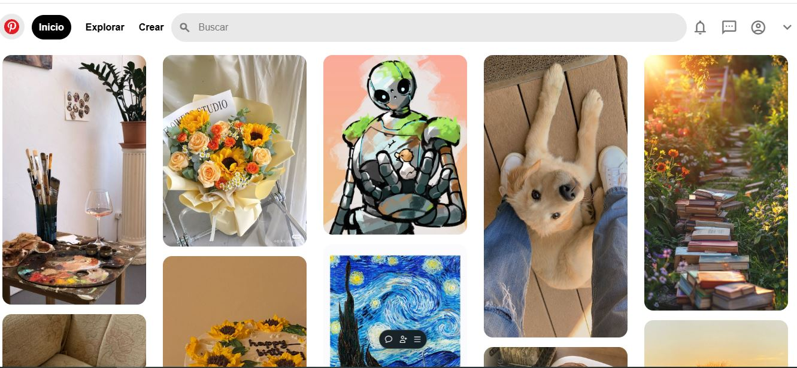

# Portafolio de proyectos

### María José Borjón Ibarra

Hola soy **María**, Ingeniera en Sistemas Computacionales.

____

## El proyecto cuensta con las secciones de:

- Habilidades
- Proyectos
- Testimonios
- Contacto😊
<!-- Pata los emojis es win + punto  -->

## 🛠 Tecnologías utilizadosd
- 💻HTML
- 🎨CSS
- 📐JS
- ✨Boostrap

<!-- Como puedes ver a continuacion tambien se puede agregar codigo html -->

    
    

### VISTA PREVIA
<!-- En esata parte debemos de poner las capturas del proyecto ya concluido -->

<!-- Escribir mensje de despediada -->
<!-- En el readme es tambien posible agregar algunos botones  -->

### Cualquier sujerencia o comentario en 
**Coreo:** 
[mari_jose1997@live.com](mailto:mari_jose1997@live.com)

<!--  -->

